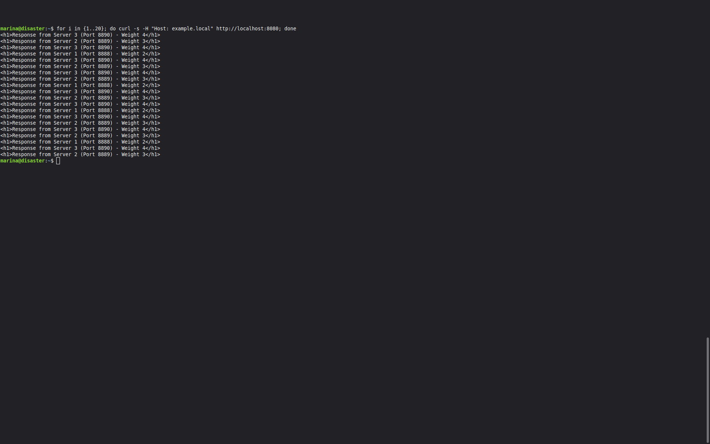

# HAProxy-Nginx
## Домашнее задание к занятию 2 «Кластеризация и балансировка нагрузки» Кукушкина Марина

## Задание 1

## Конфигурационный файл HAProxy

```bash
global
    daemon
    maxconn 256

defaults
    mode tcp
    timeout connect 5000ms
    timeout client 50000ms
    timeout server 50000ms

listen stats
    bind :8081
    mode http
    stats enable
    stats uri /stats
    stats realm HAProxy\ Statistics
    stats auth admin:admin

frontend web_frontend
    bind *:8080
    mode tcp
    default_backend web_servers

backend web_servers
    mode tcp
    balance roundrobin
    server s1 127.0.0.1:8888 check inter 3s
    server s2 127.0.0.1:9999 check inter 3s
```
## Cкриншот с перенаправление запросов на разные серверы


## Задание 2: HAProxy + Weighted Round Robin (7 уровень)

## Конфигурация HAProxy

```bash
global
    daemon
    maxconn 256

defaults
    mode http
    timeout connect 5000ms
    timeout client 50000ms
    timeout server 50000ms

listen stats
    bind :8081
    mode http
    stats enable
    stats uri /stats
    stats realm HAProxy\ Statistics
    stats auth admin:admin

frontend web_frontend
    bind *:8080
    mode http
    acl is_example_local hdr(host) -i example.local
    http-request deny if !is_example_local
    use_backend web_servers if is_example_local

backend web_servers
    mode http
    balance roundrobin
    server s1 127.0.0.1:8888 check inter 3s weight 2
    server s2 127.0.0.1:8889 check inter 3s weight 3
    server s3 127.0.0.1:8890 check inter 3s weight 4
```

## С доменом example.local (работает) 



## Без домена example.local (отклоняется)


## Задание 3: HAProxy + Nginx (статику отдаёт Nginx)


##  Конфигурационный файл Nginx


```nginx
server {
    listen 80 default_server;
    listen [::]:80 default_server;

    root /var/www/html;
    index index.html index.htm;

    server_name _;

    # Статические файлы (.jpg) отдаём сами
    location ~* \.jpg$ {
        root /var/www/images;
        expires 30d;
        add_header Content-Type image/jpeg;
    }

    # Все остальные запросы отправляем на HAProxy
    location / {
        proxy_pass http://127.0.0.1:8080;
        proxy_set_header Host $host;
        proxy_set_header X-Real-IP $remote_addr;
        proxy_set_header X-Forwarded-For $proxy_add_x_forwarded_for;
    }
}
```
## Конфигурационный файл HAProxy


```bash
global
    daemon
    maxconn 256

defaults
    mode http
    timeout connect 5000ms
    timeout client 50000ms
    timeout server 50000ms

listen stats
    bind :8081
    mode http
    stats enable
    stats uri /stats
    stats realm HAProxy\ Statistics
    stats auth admin:admin

frontend web_frontend
    bind 127.0.0.1:8080
    mode http
    default_backend web_servers

backend web_servers
    mode http
    balance roundrobin
    server s1 127.0.0.1:8888 check inter 3s weight 2
    server s2 127.0.0.1:8889 check inter 3s weight 3
    server s3 127.0.0.1:8890 check inter 3s weight 4
```
## Скриншот с запросами jpg картинок и других файлов на Simple Python Server


## Задание 4: HAProxy с разными бэкендами для разных доменов

##  Конфигурация HAProxy

```bash
global
    daemon
    maxconn 256

defaults
    mode http
    timeout connect 5000ms
    timeout client 50000ms
    timeout server 50000ms

listen stats
    bind :8081
    mode http
    stats enable
    stats uri /stats
    stats realm HAProxy\ Statistics
    stats auth admin:admin

frontend web_frontend
    bind *:8080
    mode http

    acl is_example1 hdr(host) -i example1.local
    acl is_example2 hdr(host) -i example2.local

    use_backend backend_example1 if is_example1
    use_backend backend_example2 if is_example2
    default_backend no_match

backend backend_example1
    mode http
    balance roundrobin
    server s1 127.0.0.1:8888 check inter 3s
    server s2 127.0.0.1:8889 check inter 3s

backend backend_example2
    mode http
    balance roundrobin
    server s3 127.0.0.1:8890 check inter 3s
    server s4 127.0.0.1:8891 check inter 3s

backend no_match
    mode http
    http-request deny deny_status 403
```
## Cкриншот, демонстрирующий запросы к разным фронтендам и ответам от разных бэкендов.


